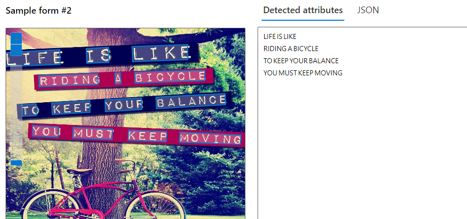

## Reconhecimento Facial e transformação de imagens em Dados no Azure ML

Project - TO DO

 - [x] Crie um novo repositório no github com um nome a sua preferência
 - [x] Crie uma pasta chamada 'inputs' e salve as imagens que você utilizou
 - [x] Crie uma pasta chamado 'output' e salve os resultados de reconhecimento de texto nessas imagens
 - [x] Crie um arquivo chamado readme.md , deixe alguns prints descreva o processo, alguns insights e possibilidades que você aprendeu durante o conteúdo.
 - [x] Compartilhe conosco o link desse repositório através do botão 'entregar projeto'

## Processo:

# Criação do recurso:

# Detext faces in an image:
Conseguiu reconhecer uma grande maioria de rostos em uma imagem com os rostos de lado, porém não reconnheceu alguns que estavam com objetos na frente:

# Extract text from images:
Teste com sucesso de extração de texto:
Quando consegue extrair o texto, o JSON retorna as palavras ou frases com as coordenadas dos pontos de onde o texto está ná imagem:

Quando tentamos extrair texto de uma imagem que não contém, ele diz que não foi detectado texto e o retorno do JSON é um vetor vazio:

 # Credito das fotos:
 Foto de Pixabay httpswww.pexels.compt-brfotoatletas-correndo-no-atletismo-oval-em-fotografia-em-escala-de-cinza-34514,
 Foto de Andrea Piacquadio: https://www.pexels.com/pt-br/foto/homem-de-camisa-vermelha-de-mangas-compridas-853151/,
 Foto de Sebastian Arie Voortman: https://www.pexels.com/pt-br/foto/2-mulheres-sentadas-na-rocha-durante-o-dia-214576/,
 Foto de Pixabay: https://www.pexels.com/pt-br/foto/close-da-mao-humana-327533/,
Foto de Djordje Petrovic: https://www.pexels.com/pt-br/foto/homem-de-camisa-preta-sentado-atras-da-mesa-com-computadores-2102416/,
Foto de Andrea Piacquadio: https://www.pexels.com/pt-br/foto/grupo-de-pessoas-em-pe-ao-lado-da-agua-2672979/
