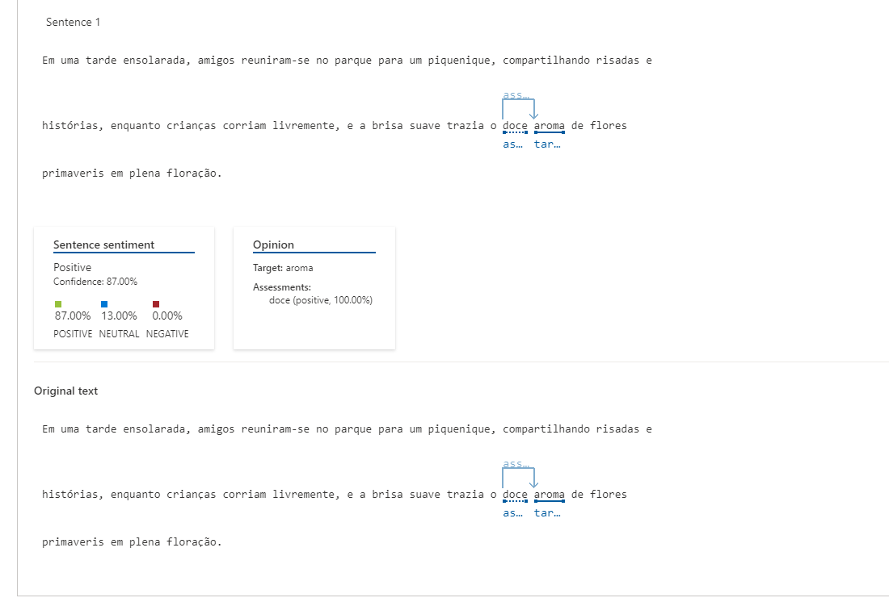
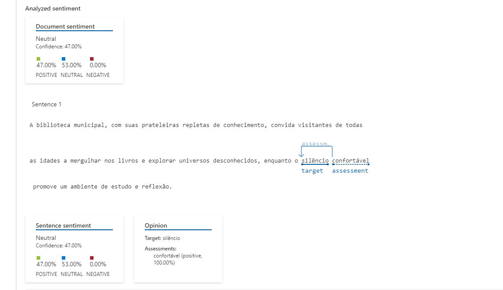
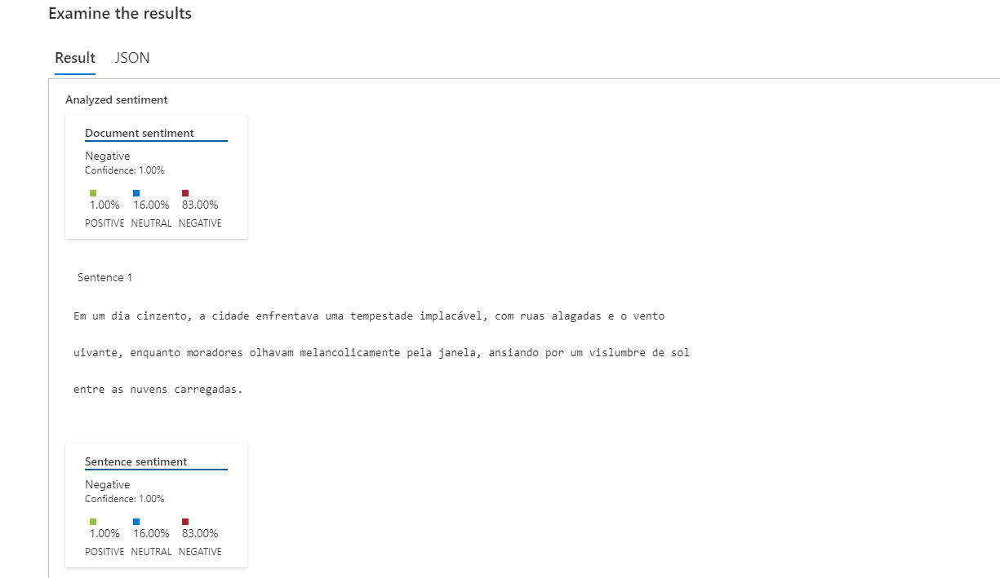

## Análise de Sentimentos com Language Studio no Azure AI

Project - TO DO

 - [x] Crie um novo repositório no github com um nome a sua preferência
 - [x] Crie uma pasta chamada 'inputs' e crie um documento de texto com algumas sentenças
 - [x] Crie um arquivo chamado readme.md , deixe alguns prints descreva o processo, alguns insights e possibilidades que você aprendeu durante o conteúdo após a IA analisar suas sentenças
 - [x] Compartilhe conosco o link desse repositório através do botão 'entregar projeto'

 ## Fotos:
Texto positivo
 

Texto mais neutro
 

Texto negativo
