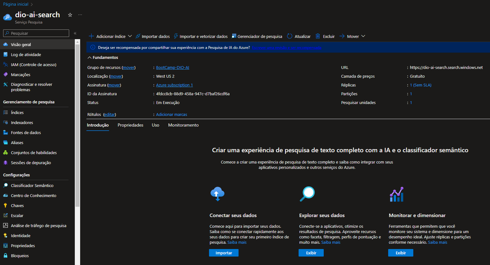
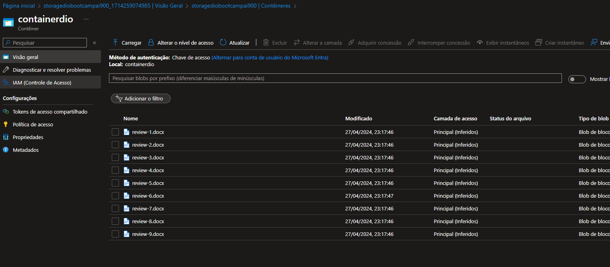
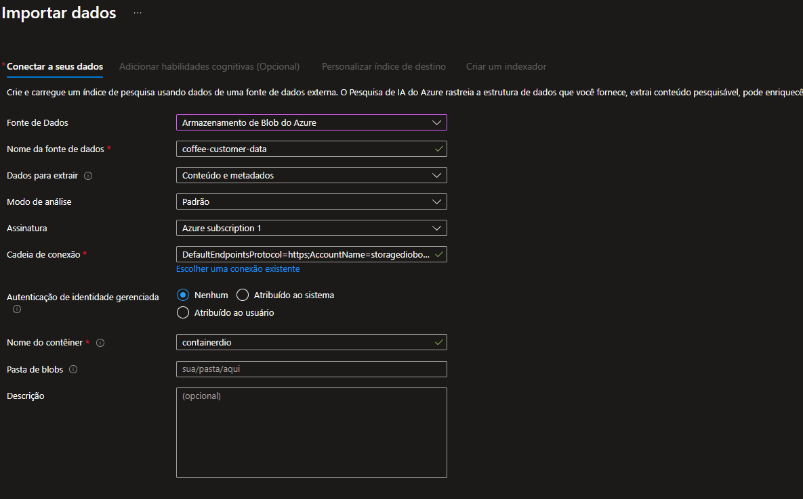
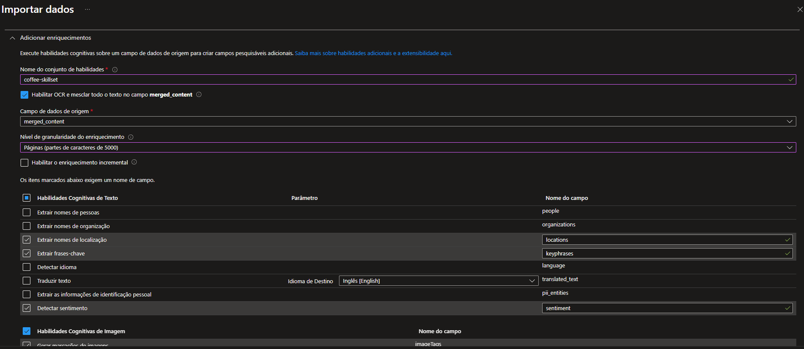
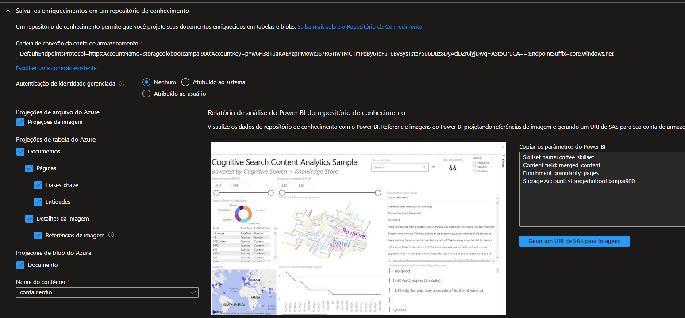
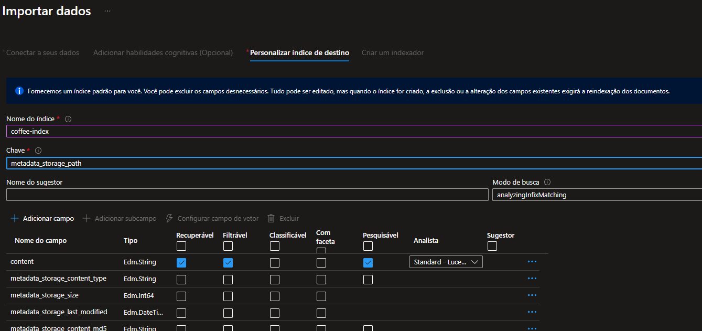
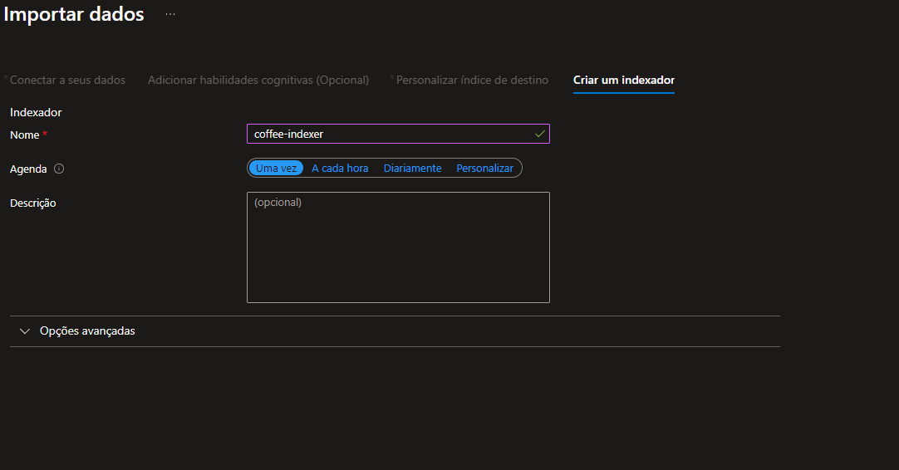
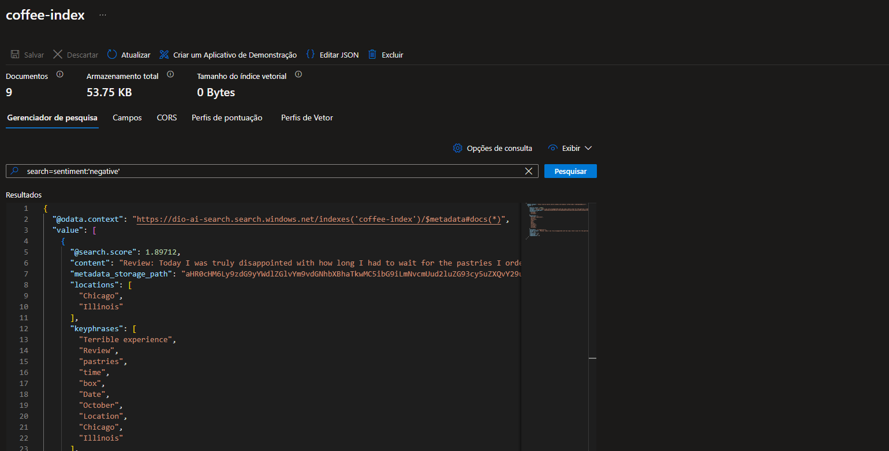

## Azure Cognitive Search: Utilizando AI Search para indexação e consulta de Dados

Project - TO DO

 - [x] Crie um novo repositório no github com um nome a sua preferência
 - [x] Crie um um arquivo readme.md descrevendo o passo a passo para se configurar uma pesquisa, assim como seus insights, possibilidades de ferramentas que se beneficiam com esse tipo de ferramenta e aprendizados adquiridos durante o processo.
 - [x] Compartilhe conosco o link desse repositório através do botão 'entregar projeto'

 
# Criando o servico de pesquisa

# Criando o storage account e populando com dados

# Importando os dados no servico de pesquisa

# Fazendo pesquisa no servico na base de dados importada

