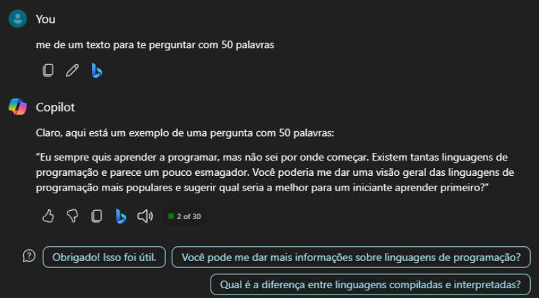
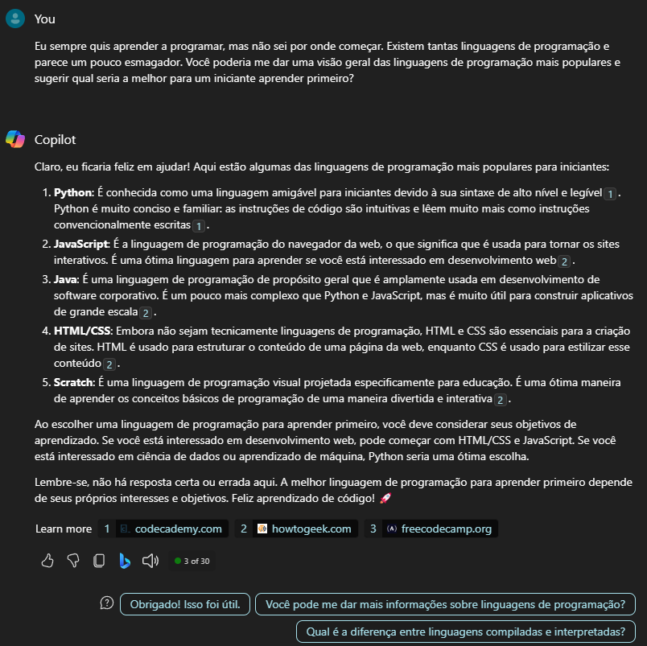

## Explorando os Recursos de IA Generativa com Copilot e OpenAI

Project - TO DO

 - [x] Crie um novo repositório no github com um nome a sua preferência
 - [x] Crie uma pasta chamada 'inputs' e salve as imagens que você utilizou
 - [x] Crie uma pasta chamado 'output' e salve os resultados de reconhecimento de texto nessas imagens
 - [x] Crie um arquivo chamado readme.md , deixe alguns prints descreva o processo, alguns insights e possibilidades que você aprendeu durante o conteúdo.
 - [x] Compartilhe conosco o link desse repositório através do botão 'entregar projeto'

 # Lab
 Esse desafio foi bem tranquilo, como eu já estou habituado a usar o copilot, foi apenas mais exploratório e criativo

